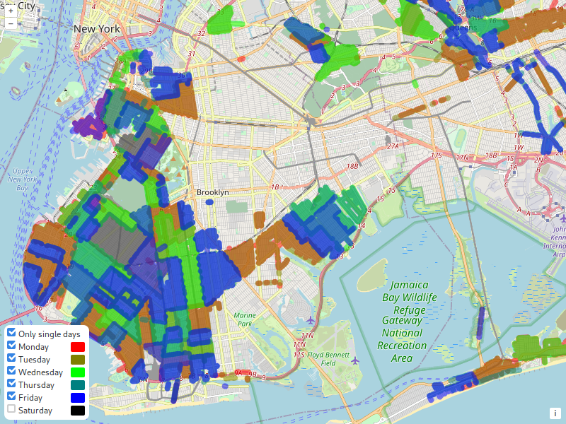

# Street Parker 2

### New York City Alternate Side Parking Color Overlay on Open Street Map

#### Try it &nbsp; --> &nbsp; https://mai-gh.github.io/streetparker2/

---

This is a re-creation of the original (and now non-existent) streetparker

https://web.archive.org/web/20160629162112/http://www.nycparklife.com/streetparker/

https://web.archive.org/web/20160621142412/http://www.nycparklife.com/streetparker/about.html

https://streetparker.splashthat.com/

---

#### Resources / Libraries Used:

Data: https://data.cityofnewyork.us/Transportation/Parking-Regulation-Locations-and-Signs/xswq-wnv9

OpenStreetMap: https://www.openstreetmap.org/

OpenLayers: https://openlayers.org/

GeoJSON Vector Tiles: https://github.com/mapbox/geojson-vt

Fiona: https://github.com/Toblerity/Fiona
